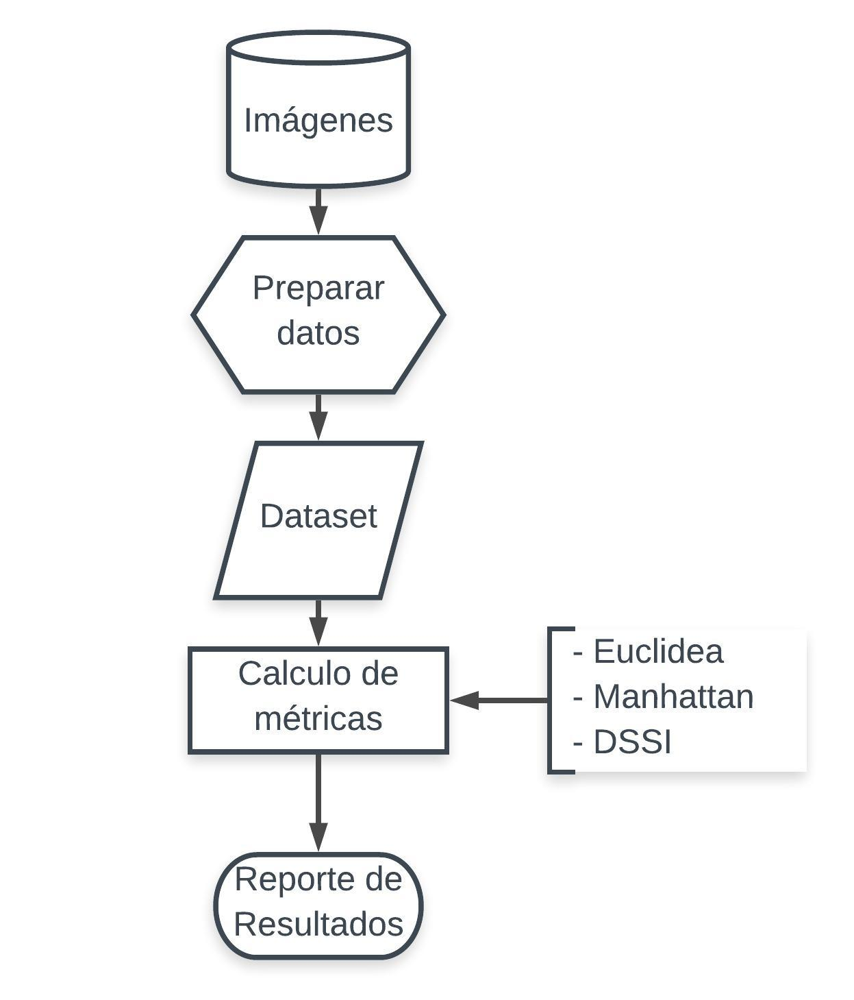

# Proyecto_Integrador1

## Descripción

Este repositorio hace respuesta al trabajo de procesamiento de imágenes que está en este [link](https://docs.google.com/document/d/17uPzsD2PQmVAoKm4ZYjob9AIDDU_Uum0vs5Z9SrwmeA/edit)

En particular lo que se muestra hasta ahora en este trabajo es muy sencillo, en realidad lo que tenemos varias fotos de rostros humanos y un grupo de imágenes que sabemos a priori que son outliers dado que para un humano es claro que no pertenecen a el grupo inicial (No so rostros humanos). Se desarrollaron dos enfoques de comparación:

1. Pertenencia de una nueva imagen: Dada una nueva imagen, esta pertenece al grupo inicial? Es decir, dada una nueva imagen podemos definir si es un rostro?
2. Identificación de outliers: Podemos identificar cuales son las imágenes que no son rostros dentro de un grupo de imágenes?

## Arquitectura

Para la solución del problema planteado  es necesario definir un flujo que permita entender cómo se abordó el problema, dicho flujo se ilustra en la siguiente figura

1. leer la imagen
2. eliminar los componentes RGB para reexpresar en escala de grises
3. escalar a una dimensión estándar
4. almacenar en una estructura de datos.

Se define entonces un dataset D que puede ilustrarse como una figura tridimensional similar a un prisma de NxMxM donde N corresponde al número de imágenes procesadas y M corresponde a la dimensión estándar a la que se escala cada imagen. Así, un elemento d[n,i,j] en D corresponde al pixel en la posición i,j de la n-ésima imagen.

En este orden de ideas, dados una métrica y una imagen referente (Para el caso de este trabajo, se toman la imagen media y mediana del dataset.), se calculan las distancias de cada imagen en el dataset a dicha imagen referente y se reportan los resultados obtenidos en la identificación de outliers en el dataset.

Todo este proceso se desarrolló en Python 3.7 debido a las ventajas que presenta como lenguaje abierto así como la potencia que tiene. Para facilitar la etapa de preparación de las imágenes, se empleó la interfaz de [OpenCV](https://opencv.org/) para Python. 

## Guia de uso

Una vez se clona el proyecto se tienen 2 archivos principales.

- Entrega1.ipynb: Este notebook simplemente lee el dataset de la carpeta input y muestra los resultados obtenidos 
- user_input(Demo).ipynb: Este notebook se debe correr todo y responder de forma interactiva. En general las decisiones son elegir la métrica a usar y tomarse fotos para luego ver la norma de las nuevas fotos con respecto al dataset.

## Dependencias

Todo el código está hecho en python 3.7 donde además se utilizaron las siguientes librerías

- cv2 (openCV) Librería utilizada para tomar fotos y leer imágenes
- numpy Libreria utilizada para el calculo de varias distancias y el manejo de 	-	- matrices
- matplotlib.pyplot Libreria base para hacer gráficas
- seaborn  Librería para hacer gráficas estadísticas más estéticas
- sklearn Libreria importante para calcular la matriz de confusión
- skimage libreria usada para calcular el SSIM
- collections Librería que tiene una función para contar cuantos elementos de un vector cumplen una condición
- pandas: Es usada para poder cargar y guardar las distancias precalculadas para el demo.

